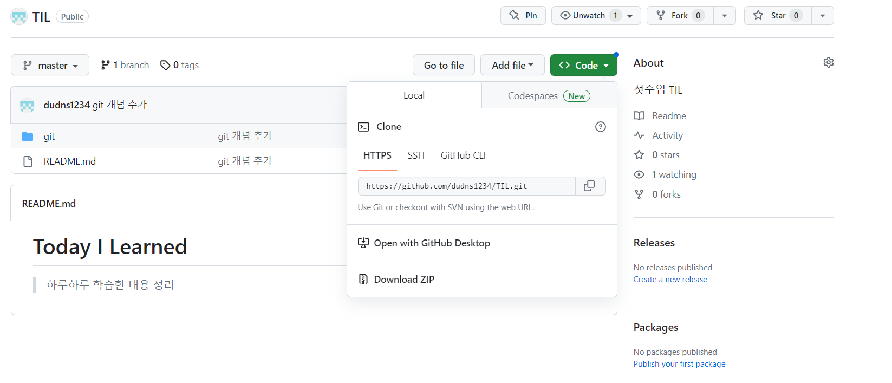
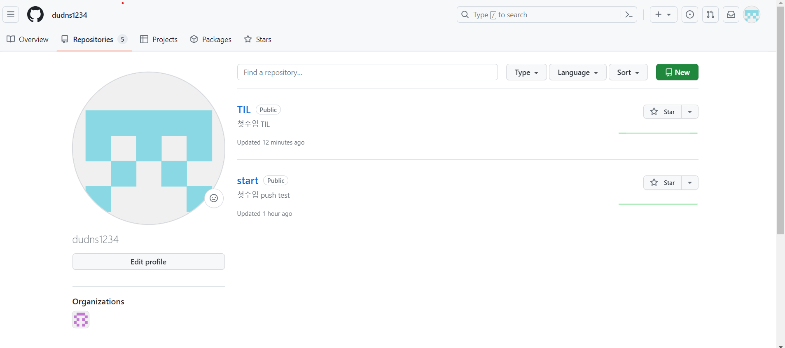

# git

## 버전 관리란?
“버전 관리” 는 무엇이고 우리는 왜 이것을 알아야 할까? 버전 관리 시스템은 파일 변화를 시간에 따라 기록했다가 나중에 특정 시점의 버전을 다시 꺼내올 수 있는 시스템이다. 이 책에서는 버전 관리하는 예제로 소프트웨어 소스 코드만 보여주지만, 실제로 거의 모든 컴퓨터 파일의 버전을 관리할 수 있다.

## 분산 버전 관리 시스템 (DVCS)


## 세가지 상태


## 명령어 (GIt Bash)

### github 코드 올리기
- push 처음할 때 **init** 꼭 진행
- `.git directory`를 생성하는 명령어
```shell
git init
```

- `working directory`에 있는 파일, 폴더를 `staging area`에 추가
- add 하기전엔 파일이 저장이 되었는지 확인하기
```shell
- 모든 파일
git add .

- 특정 파일
git add <특정 파일 경로>
git add 1_git/1_git.md
```

- `staging area`에 올라간 파일들을 저장 (github 처음 연동할 때)
```shell
git commit -m 'message
```

- 원격저장소 주소를 origin이라는 별명으로 저장
```shell
git remote add origin <remote url>
```

- `master` 브랜치를 `origin` 원격저장소로 업로드
```shell
git push origin master
```

### Github에서 상대방 코드 가져올 때
- 원격 저장소에 있는 레포를 현재 폴더에 복제
```shell
git clone <remote url>

```
- 원격 저장소에 마지막 코드 상태를 다운로드
```shell
git pull origin master
```
- `Reinitialized existing Git repository` 오류날 시에 대처법
```shell
git remote -v
git remote rm origin
```

## git 까지의 세세한 과정
1. 바탕화면에 폴더 생성 C:\Users\yujin\Desktop\camp29\TIL
2. TIL 폴더에 들어가서 마우스 오른쪽 -> Code로 열기 진행
3. git init

    - 현재 폴더에 `.git` 폴더를 생성
    - .git directory를 만든 것
    - **최초로 한 번 설정**
4. git add .
    - 'Working Diectory' 에서 'Staging Area'로 파일을 업로드
    - `git status` 로 현재 상태를 체크    
    - 주의할 점 : add 뒤에 띄어쓰기한 후에 .

5. git commit -m "git 개념 추가"
    - 'staging area'에 올라간 파일들의 스냅샷을 찍어 '.git directory'에 저장
    - 일반적으로 '-m' 옵션을 넣어서 커밋메세지를 추가하여 등록
    -

6. git remote add origin https://github.com/dudns1234/TIL.git
    - remote : 원격 저장소를 관리하는 명령어 
    - 주소는 나의 github에 새로운 repository를 만든다.
    - 
    - 
    - 
    - **최초로 한 번 설정**

7. git push origin master
    - origin : 업로드할 github 주소의 별명
    - master : 여러가지의 branch 모음집..?

8. 내용 수정 후에는 ctrl + S 해준후에 2,3,5번 작업 진행해주면 됨.
