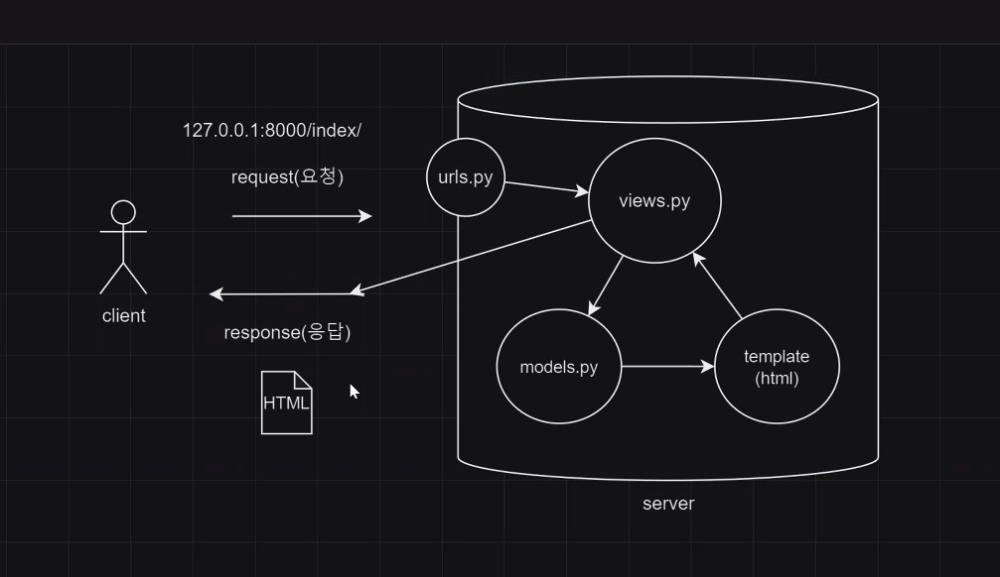
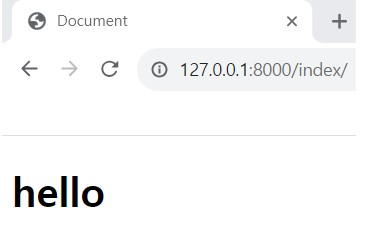
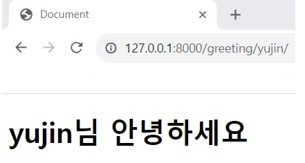
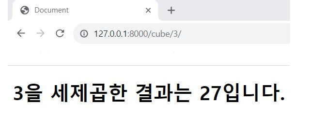

# 웹사이트
- html,css로 가능하지만
- **Django**로도 가능

## django 파일
- `__init__` : 패키지
- admin.py : 관리자
- models.py : 데이터베이스(데이터 정의)
- tests.py : 테스트 코드
- **views.py**
    - html파일이 화면에 어떻게 보일지를 설정
    - 들어오는 요청 url을 파싱하여 라우팅 처리된 특정 요청을 처리하는 공간
    - render : 결과물을 만들어냄
- **urls.py**
    - url관리
    - url을 만들어 연결
- **Template** 폴더 생성 : View로부터 전달된 데이터를 템플릿에 적용하여 Dynamic 한 웹페이지를 만드는데 사용

## django Framwork
- M V C (model views controller) => python식
- M T V (model template views) => django식

## django 흐름

1. client가 특정 주소를 요청함 (request)
    - 127.0.0.1:8000/index
    - 127.0.0.1:8000/greeting/yujin
    - 127.0.0.1:8000/cube/3
2. **urls.py** 에서 url 주소를 받아냄
    ```python
        path('index/', views.index),
        path('greeting/<name>/',views.greeting),
        path('cube/<int:num>/',views.cube),
        # 바로 int처리하기 위해서 <int:num>
    ```
3. **views.py** 에서 url 처리해서 넘기라고 요청 받음
    - index라는 함수 정의
    - urls.py에서 "index"을 호출하면, views.py의 "index" 함수가 실행
    - 요청이 들어오면, 'index.html' 주소를 반환해 준다는 뜻 (render)
    ```python
    def index(request):
        return render(request, 'index.html')

    def greeting(request, name):
        result = {
            'name':name,
        }
        return render(request, 'greeting.html', result)

    def cube(request, num):
        result = {
            'num' : num,
            'cube' : num ** 3,
        }
        return render(request,'cube.html',result)
    ```   
4. models
    - 데이터베이스에 있는 데이터 꺼내옴
5. **template(html)**
    - templates 폴더에서 *.html 파일 생성
        - index.html, greeting.html, cube.html
    - ! + enter : 틀 생성
    - `<body>__</body>` __에다가
    ```html
        <body>
            <h1>hello</h1>
        </body>

        <body>
            <h1>{{name}}님 안녕하세요</h1>
        </body>

        <body>
            <h1>{{num}}을 세제곱한 결과는 {{cube}}입니다.</h1>
        </body>
    ```
6. 웹 실행 (HTML response)
- 서버 실행 : `python manage.py runserver`
- http://127.0.0.1:8000/index   

- http://127.0.0.1:8000/greeting/yujin   

- http://127.0.0.1:8000/cube/3   

        