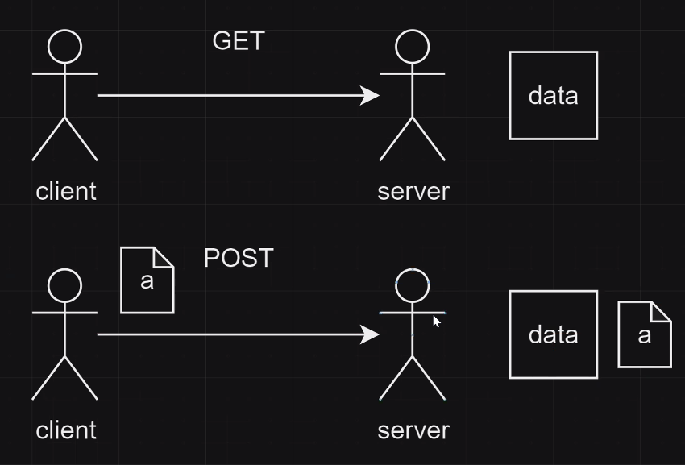

# 웹서비스
- HTML : 웹 언어
- CSS : 만든 웹을 사람이 보기 좋게 꾸며줌
- HTTP : 만든 HTML을 어떻게 전송할 것인지에 대한 프로토콜

[W3schools](https://www.w3schools.com/)
[mdn](https://developer.mozilla.org/ko/)

## 웹 만들기
1. 기본 틀 생성 : `! + tab/Enter `
2. 웹 새로고침으로 변경사항 실시간 확인
3. 기본 Coding
    - 주석 : Ctrl + /
    - HTML의 기본구조  
    요소(Element) : `<태그이름>내용</태그이름>` == `<여는태그>내용</닫는태그>`  
    - 닫는태그 안하는 경우도 있긴함
4. 속성 : <여는 태그> 안에 속성key = 속성value
    - `<태그이름 속성명 = "속성값" 속성명2 = "속성값2"> 내용 </태그이름>`
## head 태그 안
- 문서 정보들을 담는 공간
- `<link rel="icon" href="./assets/image/background.jpg">` : link 아이콘 설정
## Body 태그 안
- 브라우저 화면에 나타나는 정보들을 담는 공간
- 거의 모든 태그는 `<body></body>` 안에 들어감
- 주요 태그
    1. `<a>하이퍼텍스트</a>`
        - 속성 : target="_blank" => 새로운 웹사이트로 열어줌 
    2. `<h>제목</h>` (h1,h2,...,h6:폰트사이즈 X 중요도라고 생각해야함)
    3. `
문단
`
        - Lorem + tab : 더미데이터만들어줌(예시로 긴데이터를 만들때)
        - Formatting elements : `<b>내용</b>`,`<strong>내용</strong>`    
            - Q. `<b>내용</b>`,`<strong>내용</strong>` 다른점?   
              A. strong 태그는 시맨틱 태그임. 의미적으로 중요할 때 사용, b태그는 단지 글자를 굵게 만드는 용도. strong 태그는 웹에서 분석할 때 의미적으로 의미있는 부분이라는 걸 알기위함.
        - 속성 : class=, id=
    4. `<ul>제목</ul>` : 순서 없이 정렬 (list)
        - 속성 : `style="list-style-type: square;"`, class=
        - 주요태그 : `<li>내용</li>`
        - 한 번에 여러개 만들기
        (ul>li*3 : ul태그의 자식으로 li태그 3개 만들어달라)
    5. `<ol>제목</ol>` : 순서 있이 정렬 (list)
        - 속성 : type="i"
        - 주요태그 : `<li>내용</li>`
        (ol>li*3 : ol태그의 자식으로 li태그 3개 만들어달라)
    6. `` 
        - 닫는 태그는 없음.
        - 속성
            - src= : 이미지경로(src : source)
            - alt= : 이미지가 안떴을 때 사용할 단어
            - width= , height= : 사진 넓이
    7. `<i></i>`
        - 아이콘 넣기
        - 속성 : class=
        - [icon site](https://fontawesome.com/icons/palette?f=classic&s=solid)

### table 태그 안
- Boby 태그 안에 들어가는 tabel 태그
- 속성
    - style="border: 1px solid"
- 주요태그
    - `<tr></tr>` : table row
    - `<th>내용</th>` : table 헤더
        - 속성 : style="border: 1px solid"
    - `<td>내용</td>` : table 데이터
        - 속성 : colspan="2", rowspan="2"
    - 한 번에 여러개 만들기  
    (tr*3>td*3 : tr 3개 만들어주는데 안에 td 3개씩 만들어달라는 의미)

## Form 태그
- h태그, p태그도 다 가능
- Boby 태그 안에 들어가는 form 태그
- a를 만들기 위함

- 주요태그
    - `

`
        - 태그를 연속으로 적게 되면 가로로 되는데 div를 적으면 세로로 됨
    - `
`
        - 임의의 선
    - `<select></select>`
        - 속성 : name="" id=""
        - 주요태그
            - `<option>내용</option>`
                - 속성 : value=""
    - `<textarea></textarea>`
        - 택스트를 자유롭게 크기를 설정하여 작성
        - 속성
            - name=""
            - id=""
            - cols=""
            - rows="" 
    - `<label>내용</label>`
        - input받는 내용의 제목
        - 연결될 태그로 이동 (for,id를 연결)
        - 속성 : for=""
    - `<input>`
        - 입력한 데이터가 자동으로 value 값으로 들어감
        - value에 넣는 게 닫는 태그가 없어서
        - 닫는 태그는 없음.
        - 속성
            - type="checkbox", "radio", "text", "email", "password", "date","submit"
            - name="" : 링크에 ?뒤로 나오는 **key**=value
            - value="" : 링크에 key=**value**    
            (checkbox, rabio인경우 사용 - 왜? 다른건 내가 직접입력하는데 2개는 클릭하는 value가 뭔지 지정필요)
            - id=""
    - label태그 - input태그 연결 : for(label태그), id(output태그)로 연결
    - 웹사이트에서 input을 넣고 Enter를 치면 나오는 링크    
    file:///C:/Users/yujin/Desktop/camp29/web/2.form.html?username=yujin&pw=a1234   를 ? 기준으로 뜯어서 보면       
    file:///C:/Users/yujin/Desktop/camp29/web/2.form.html   
    ?   
    **username** = *yujin* (**key** = *value*) - value : 웹에서직접입력   
    &  
    **pw**=*a1234* (**key** = *value*) - value : 웹에서직접입력   
    &   
    **choice**=*css*(**key** = *value*) - value : HTML에서 value값 지정   
    - label태그와 input태그 순서의 차이
     
     - label - input인 경우 : label 내용 + input박스
     - input - label인 경우 : input박스 + label 내용

    
