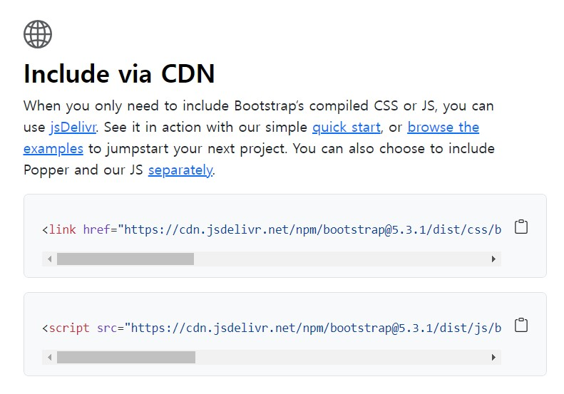
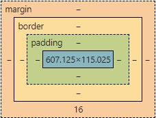

# Bootstrap
- [Boostrap](https://getbootstrap.com/) 으로 웹 만들기/꾸미기
- 사용하기 위해서는 link는 head 태그 / script는 body 태그에 복사 붙여넣기 해주기.


## Utilities
- [Background](https://getbootstrap.com/docs/5.3/utilities/background/)
    - .`bg-success`, `.bg-warning`
    - `<h1 class="text-success bg-primary">world</h1>`
- [Borders](https://getbootstrap.com/docs/5.3/utilities/borders/)
    - m-3 : 마진을 3으로 설정 (mx-3 : margin-x / my-3: margin-y)
    - p-3 : 패딩을 3으로 설정  
    
- [Colors](https://getbootstrap.com/docs/5.3/utilities/colors/)
    - text-success : text 색 바로 지정(success는 초록색)
    - border-warning : border 색 바로 지정(warning은 노란색)
- [Display](https://getbootstrap.com/docs/5.3/utilities/display/)
    - d-inline : display
    - d-none : display에 안보여줌
- [Flex](https://getbootstrap.com/docs/5.3/utilities/flex/)
    - 개구리 게임 했던 것
    - `<div class="d-flex justify-content-between border align-items-center">`


## 코드 줄임
```html
<!-- 띄어쓰기 금지 -->
div.d-flex>div.p-2*3


<div class="d-flex">
            <div class="p-2"></div>
            <div class="p-2"></div>
            <div class="p-2"></div>
```


## Components
1. [Alerts](https://getbootstrap.com/docs/5.3/components/alerts/)
2. [Buttons](https://getbootstrap.com/docs/5.3/components/buttons/)
3. [card](https://getbootstrap.com/docs/5.3/components/card/)
4. [Navbar](https://getbootstrap.com/docs/5.3/components/navbar/)
    - container 태그 밖에 설정