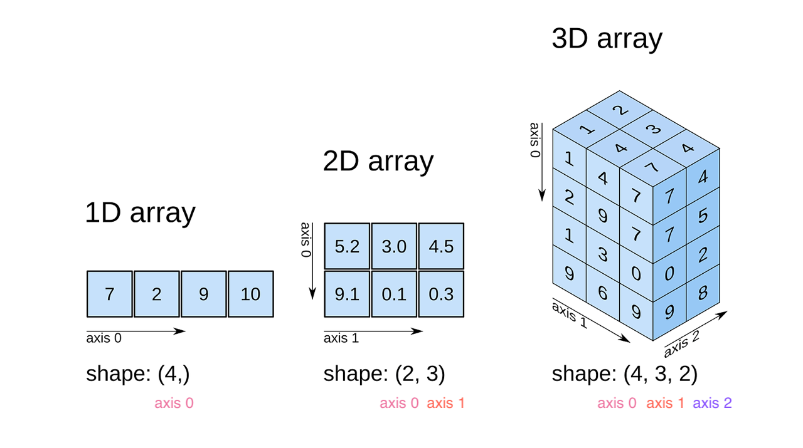
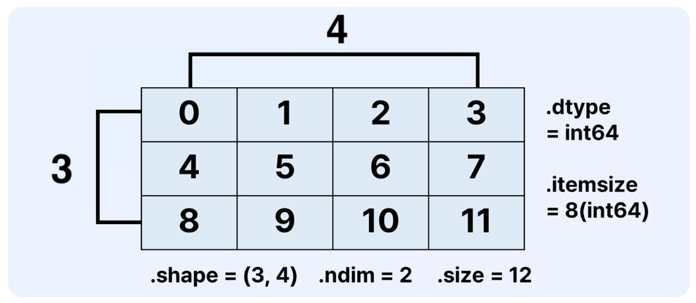

## 🦥 본문

> 💡 `import numpy as np`

위 구문으로 [NumPy](https://numpy.org/doc/stable/) 를 사용한다고 전제한다.

## ⭐ 설치 및 환경

- 가상환경은 [pyenv](https://github.com/pyenv/pyenv) 와 `pyenv` 의 [virtualenv](https://github.com/pyenv/pyenv-virtualenv)
  플러그인을 사용해서 만들었다.

    - `pyenv` 설치 및 사용법은 이 [문서](https://wikidocs.net/10936#pyenv)를 참고하는 것이 좋다.

- Python: 3.12.7

- Numpy: 2.2.4

아래의 명령어를 사용해서 numpy 를 설치하고 실습을 진행했다.

```shell
pip install numpy==2.2.4
```

## 🎲 ndarray

- n-dimension array 라는 의미! 즉, 다차원 배열을 표현하는 데이터 타입

- `ndarray` 는 수학의 vector 와 matrix 개념을 python 에서 효율적으로 표현하기 위한 데이터 타입

- 내부 구현은 CPython 으로 구현되어있어 속도가 매우 빠르고 메모리 관리가 효율적

- *python 의 list 와는 다르다!*

### dimension 은  axis (축)



- `ndarray` 의 모양을 나타낼 때, shape 이라는 말을 사용하고, (axis 0 의 item 수, … , axis n 의 item 수) 라는 `tuple` 을 보여준다.

  예시)

    - 1D array; shape:(갯수, )

    - 2D array; shape:(갯수, 갯수)

    - 3D array; shape:(갯수, 갯수, 갯수)

- `tuple` 이 아무리 길어도 index 번호가 곧 axis 번호. 즉, 마지막 2차원이 매우 익숙한 2차원 배열!

<br/>

### 대표적인 attributes



- `shape`: 각 축의 크기를 tuple 로 표현한 속성. ex.) (4, 3, 2)

- `ndim`: 차원의 개수

- `dtype`: 요소(Element) 의 data type. (ndarray 는 1개의 데이터 타입만 갖는다.)

- `itemsize`: 요소(Element) 의 bytes. ex.) dtype 이 int64 라면, itemsize 는 8(bytes) 이다.

- `size`: 전체 요소(Element) 개수

### 다양한 생성 방법

기본적으로는, numpy 의 `array(list 또는 tuple)` 함수로 생성할 수 있다.

```python
import numpy as np

a = np.array((1, 2, 3, 4))  # shape: (4,) | ndim: 1 | dtype: int64 | itemsize: 8 | size: 4
b = np.array([[0, 1], [1, 0]])  # shape: (2, 2) | ndim: 2 | dtype: int64 | itemsize: 8 | size: 4
c = np.array([1.2, 3.14, 7.0])  # shape: (3,) | ndim: 1 | dtype: float64 | itemsize: 8 | size: 3
```

실무에서 자주 쓰이는 방법은 다음과 같다.

- `np.zeros(shape)`: 0 으로 구성된 N 차원 배열. ex.) `np.zeros((3, 4))`

- `np.ones(shape)`: 1 로 구성된 N 차원 배열. ex.) `np.ones((10, ))`

- `np.empty(shape)`: 초기화되지 않은 N 차원 배열. ex.) `np.empty((1, 3, 4))`

<br/>

### arange 로 ndarray 만들기

- array range 의 줄임말로, N 만큼 차이나는 숫자로 1 차원 `ndarray` 를 만들어준다.

function signature, 그러니까 함수 프로토타입은 아래와 같다.

```python
np.arange([start, ]
stop[, step,], dtype = None)
```

대괄호([]) 안의 값은 생략 가능한 값으로, 사용법이 python 의 `range()` 와 비슷하다.

- `start`: 시작 값(기본값은 0)

- `stop`: 끝 값(이 값은 포함되지 않음)

- `step`: 간격(기본값은 1)

- `dtype`: 결과 ndarray 의 데이터 타입

이 함수는 아래와 같이 사용한다.

```python
np.arange(10)  # [0 1 2 3 4 5 6 7 8 9]
np.arange(10, 20)  # [10 11 12 13 14 15 16 17 18 19]
np.arange(10, 20, 5)  # [10 15]
np.arange(10, 20, 5, dtype=np.float64)  # [10. 15.]
np.arange(0, 1, 0.2)  # [0.  0.2 0.4 0.6 0.8]
```

### linspace 로 ndarray 만들기

- linearly spaced 의 줄임말로, N 등분한 숫자로 1 차원 `ndarray` 를 만들어준다.

함수 프로토타입은 아래와 같다.

```python
numpy.linspace(start, stop, num=50, endpoint=True, retstep=False, dtype=None, axis=0)
```

`arange` 와 달리 매개변수가 매우 많은데, 주요 매개변수는 아래와 같다.

- `start`: 시퀀스의 시작 값

- `stop`: 시퀀스의 끝 값

- `num`: 생성할 샘플의 개수 (기본값: 50)

- `endpoint`: True이면 `stop`을 포함, False이면 제외 (기본값: True)

- `retstep`: True이면 샘플 간격도 함께 반환 (기본값: False)

- `dtype`: 출력 배열의 데이터 타입

- `axis`: 출력 배열에서 값들이 위치할 축 (기본값: 0)

이 함수는 아래와 같이 사용한다.

```python
np.linspace(10, 20)  # 10부터 20까지를 50 등분한 1차원 ndarray 
np.linspace(10, 20, 5)  # [10.  12.5 15.  17.5 20. ]
np.linspace(10, 20, 5, dtype=np.int64)  # [10 12 15 17 20]
```

<br/>

그럼 언제 `arange` 와 `linspace` 의 차이와 언제 어떤 것을 사용하면 좋을까?

| 특성    | arange         | linspace   | 
 |-------|----------------|------------| 
| 지정 방식 | 간격(step) 지정    | 개수(num) 지정 | 
| 끝점    | 포함하지 않음        | 기본적으로 포함   | 
| 정밀도   | 부동소수점 오차 발생 가능 | 정확한 균등 분할  | 

위와 같은 차이점이 있기 때문에, 적합한 사용 상황은 아래와 같이 달라 질 수 있다.

- `arange` 는,

    - 정수 범위를 생성할 때 (예: 0, 1, 2, ..., 9)

    - 정확한 간격을 알고 있을 때

    - 간단한 인덱싱이나 반복에 사용할 때

- `linspace` 는,

    - 시작점과 끝점을 모두 포함해야 할 때

    - 정확한 개수의 샘플이 필요할 때

    - 그래프 플로팅이나 수치 적분 같은 과학적 계산에서

    - 부동소수점 연산에서 정밀도가 중요할 때

즉, **정수나 정확한 간격을 알고 있을 때**는 `arange`를, **시작과 끝점 사이의 *****정확한***** 개수의 균등한 값이 필요할 때**는 `linspace`를 사용하는 것이 좋다.

## ✖️연산하기

기본적으로 `Element Wise 연산`을 하며, dtype 이 다르다면, 자동 형 변환(`int → float → complex`)이 된다.

### Element Wise 연산

- **정의**: 배열의 각 요소에 독립적으로 같은 연산을 적용하는 방식

- **기본 원칙**: 두 배열 간 연산을 할 때 같은 위치의 요소끼리 연산함

- **필요 조건**: 기본적으로 두 배열의 형태(shape)가 동일해야 함

### Broadcasting

- 다른 형태의 배열 간 연산을 위해 사용되는 기능. 즉, 크기가 다른 배열 간에도 Element Wise 연산을 가능하게 하는 메커니즘

- 규칙(순서대로 적용)

    1. 차원 맞추기: 차원 수가 적은 배열에, 1을 추가하여 차원 수를 맞춤

    1. 각 차원 요소 크기 비교: 각 차원에서 크기가 같거나, 한 쪽이 1이어야 함

    1. 크기가 1인 차원을 확장: 크기가 1인 차원을 다른 배열의 해당 차원 크기로 복사

- 규칙 3의 ”확장”이란, 크기가 1인 차원의 요소를 필요한 만큼 복사하여 배열 크기를 맞춘다는 의미

    - 실제 메모리에 새 배열을 만들지 않고, 연산 시에만 확장된 것처럼 처리

### 주로 사용하는 연산


- 산술 연산자: `+`, `-`, `*`, `/`, `**`, `%`, `//`

```python
import numpy as np

a = np.array([20, 30, 40, 50])
b = np.arange(4)  # [0, 1, 2, 3]

a + b  # [20, 31, 42, 53]
a - b  # [20, 29, 38, 47]
a * b  # [0, 30, 80, 150]
a * 10  # [200, 300, 400, 500]
b ** 2  # [0, 1, 4, 9]
b % 2  # [0, 1, 0, 1]
b // 2  # [0, 0, 1, 1]
```

- 비교 연산자: `==`, `!=`, `>`, `<`, `>=`, `<=`

```python
import numpy as np

a = np.array([20, 30, 40, 50])

a == 40  # [False, False, True, False]
a != 50  # [True, True, True, False]
a > 10  # [True, True, True, True]
a < 20  # [False, False, False, False]
a >= 40  # [False, False, True, True]
a <= 30  # [True, True, False, False]
```

- 논리 연산자: `&`, `|`, `~`

```python
import numpy as np

a = np.array([20, 30, 40, 50])

(a == 40) | (a == 50)  # [False, False,  True,  True]
(a % 2 == 0) & (a % 3 == 0)  # [False,  True, False, False]
~(a > 10)  # [False, False, False, False]
```

- `@`: 행렬 곱셈(Matrix Product)

```python
import numpy as np

A = np.array([[1, 1],
              [0, 1]])
B = np.array([[2, 0],
              [3, 4]])

A @ B  # [[5, 4], [3, 4]]
```

- `np.sum()`: 모든 요소의 합

```python
import numpy as np

# 1차원 배열
arr1 = np.array([1, 2, 3, 4, 5])
print(np.sum(arr1))  # 출력: 15

# 2차원 배열
arr2 = np.array([[1, 2, 3], [4, 5, 6]])
print(np.sum(arr2))  # 출력: 21
print(np.sum(arr2, axis=0))  # 열 방향 합계: [5, 7, 9]
print(np.sum(arr2, axis=1))  # 행 방향 합계: [6, 15]

# 메서드 형식으로도 사용 가능
print(arr2.sum())  # 출력: 21
```

- `np.min()`: 모든 요소 중 최소값

```python
import numpy as np

# 1차원 배열
arr1 = np.array([5, 2, 8, 1, 9])
print(np.min(arr1))  # 출력: 1

# 2차원 배열
arr2 = np.array([[3, 1, 7], [4, 5, 2]])
print(np.min(arr2))  # 출력: 1
print(np.min(arr2, axis=0))  # 열 방향 최소값: [3, 1, 2]
print(np.min(arr2, axis=1))  # 행 방향 최소값: [1, 2]

# 메서드 형식으로도 사용 가능
print(arr2.min())  # 출력: 1
```

- `np.max()`: 모든 요소 중 최대값

```python
import numpy as np

# 1차원 배열
arr1 = np.array([5, 2, 8, 1, 9])
print(np.max(arr1))  # 출력: 9

# 2차원 배열
arr2 = np.array([[3, 1, 7], [4, 5, 2]])
print(np.max(arr2))  # 출력: 7
print(np.max(arr2, axis=0))  # 열 방향 최대값: [4, 5, 7]
print(np.max(arr2, axis=1))  # 행 방향 최대값: [7, 5]

# 메서드 형식으로도 사용 가능
print(arr2.max())  # 출력: 7
```

- `np.argmax()`: 모든 요소 중 최대값의 인덱스

    - 중요 동작 방식

        - `axis=None`일 경우: 배열을 평탄화(flatten)하여 1차원으로 변환한 후, 전체 배열에서 최대값의 인덱스를 단일 값으로 반환한다.

        - `axis`가 지정된 경우: 지정된 축을 따라 최대값을 찾으며, 각 슬라이스에서 최대값의 해당 축 인덱스를 반환한다. 결과 배열의 형태는 입력 배열에서 지정한 축이 제거된 형태이다.

```python
import numpy as np

# 1차원 배열
arr1 = np.array([5, 2, 8, 1, 9])
print(np.argmax(arr1))  # 출력: 4 (9가 위치한 인덱스)

# 2차원 배열
arr2 = np.array([[3, 1, 7], [4, 5, 2]])

# axis=None (기본값): 배열을 평탄화한 후 최대값의 인덱스 반환
# 평탄화된 배열: [3, 1, 7, 4, 5, 2]
print(np.argmax(arr2))  # 출력: 2 (7의 인덱스)

# axis=0 (열 방향): 각 열에서 최대값의 인덱스 반환
# 0열: [3, 4] -> 최대값 4의 인덱스는 1
# 1열: [1, 5] -> 최대값 5의 인덱스는 1
# 2열: [7, 2] -> 최대값 7의 인덱스는 0
print(np.argmax(arr2, axis=0))  # 출력: [1, 1, 0]

# axis=1 (행 방향): 각 행에서 최대값의 인덱스 반환
# 0행: [3, 1, 7] -> 최대값 7의 인덱스는 2
# 1행: [4, 5, 2] -> 최대값 5의 인덱스는 1
print(np.argmax(arr2, axis=1))  # 출력: [2, 1]

# 메서드 형식으로도 사용 가능
print(arr2.argmax())  # 출력: 2

# 3차원 배열 (2x3x4)
arr3d = np.array([[[1, 2, 3, 4],
                   [5, 6, 7, 8],
                   [9, 10, 11, 12]],

                  [[13, 14, 15, 16],
                   [17, 18, 19, 20],
                   [21, 22, 23, 24]]])

# axis=None: 평탄화된 배열에서 최대값의 인덱스
print(np.argmax(arr3d))  # 출력: 23 (값 24의 인덱스)

# axis=0: 첫 번째 축(깊이)을 따라 최대값의 인덱스
# 결과 형태: (3, 4) -> 각 (행, 열) 위치에서 깊이 방향 최대값의 인덱스
print(np.argmax(arr3d, axis=0))
# 출력:
# [[1 1 1 1]
#  [1 1 1 1]
#  [1 1 1 1]]

# axis=1: 두 번째 축(행)을 따라 최대값의 인덱스
# 결과 형태: (2, 4) -> 각 (깊이, 열) 위치에서 행 방향 최대값의 인덱스
print(np.argmax(arr3d, axis=1))
# 출력:
# [[2 2 2 2]
#  [2 2 2 2]]

# axis=2: 세 번째 축(열)을 따라 최대값의 인덱스
# 결과 형태: (2, 3) -> 각 (깊이, 행) 위치에서 열 방향 최대값의 인덱스
print(np.argmax(arr3d, axis=2))
# 출력:
# [[3 3 3]
#  [3 3 3]]
```

- `np.cumsum()`: 모든 요소의 누적합

```python
import numpy as np

# 1차원 배열
arr1 = np.array([1, 2, 3, 4, 5])
print(np.cumsum(arr1))  # 출력: [1, 3, 6, 10, 15]

# 2차원 배열
arr2 = np.array([[1, 2, 3], [4, 5, 6]])
print(np.cumsum(arr2))  # 평탄화된 누적합: [1, 3, 6, 10, 15, 21]
print(np.cumsum(arr2, axis=0))  # 열 방향 누적합: [[1, 2, 3], [5, 7, 9]]
print(np.cumsum(arr2, axis=1))  # 행 방향 누적합: [[1, 3, 6], [4, 9, 15]]

# 메서드 형식으로도 사용 가능
print(arr2.cumsum())  # 출력: [1, 3, 6, 10, 15, 21]
```

### 범용 함수

매우 많은 함수를 NumPy 에서 제공하고 있기때문에 [공식 문서](https://numpy.org/doc/1.18/reference/ufuncs.html#available-ufuncs)를 한번 살펴 보는 것이
좋다.

공식 문서를 간략히 정리해보면 아래와 같다.

- 수학 연산 함수

    - add(x1, x2): 요소별 덧셈 연산을 수행한다.

    - subtract(x1, x2): 요소별 뺄셈 연산을 수행한다.

    - multiply(x1, x2): 요소별 곱셈 연산을 수행한다.

    - divide(x1, x2): 요소별 실수 나눗셈 연산을 수행한다.

    - power(x1, x2): 첫 번째 배열의 요소를 두 번째 배열의 요소만큼 거듭제곱한다.

    - sqrt(x): 요소별 제곱근을 계산한다.

    - square(x): 요소별 제곱을 계산한다.

    - absolute(x): 요소별 절대값을 계산한다.

    - exp(x): 요소별 지수 함수(e^x)를 계산한다.

    - log(x): 요소별 자연로그를 계산한다.

    - log10(x): 요소별 밑이 10인 로그를 계산한다.

- 삼각 함수

    - sin(x): 요소별 사인(sine) 함수를 계산한다.

    - cos(x): 요소별 코사인(cosine) 함수를 계산한다.

    - tan(x): 요소별 탄젠트(tangent) 함수를 계산한다.

    - arcsin(x): 요소별 아크사인(역사인) 함수를 계산한다.

    - arccos(x): 요소별 아크코사인(역코사인) 함수를 계산한다.

    - arctan(x): 요소별 아크탄젠트(역탄젠트) 함수를 계산한다

    - deg2rad(x): 각도를 도(degree)에서 라디안(radian)으로 변환한다.

    - rad2deg(x): 각도를 라디안(radian)에서 도(degree)로 변환한다.

- 비트 연산 함수

    - bitwise_and(x1, x2): 요소별 비트 AND 연산을 수행한다.

    - bitwise_or(x1, x2): 요소별 비트 OR 연산을 수행한다.

    - bitwise_xor(x1, x2): 요소별 비트 XOR 연산을 수행한다.

    - invert(x): 요소별 비트 NOT 연산을 수행한다.

- 비교 함수

    - greater(x1, x2): 요소별로 x1 > x2 비교하여 부울 배열을 반환한다.

    - greater_equal(x1, x2): 요소별로 x1 >= x2 비교하여 부울 배열을 반환한다.

    - less(x1, x2): 요소별로 x1 < x2 비교하여 부울 배열을 반환한다.

    - less_equal(x1, x2): 요소별로 x1 <= x2 비교하여 부울 배열을 반환한다.

    - equal(x1, x2): 요소별로 x1 == x2 비교하여 부울 배열을 반환한다.

    - not_equal(x1, x2): 요소별로 x1 != x2 비교하여 부울 배열을 반환한다.

- 논리 함수

    - logical_and(x1, x2): 요소별 논리 AND 연산을 수행한다.

    - logical_or(x1, x2): 요소별 논리 OR 연산을 수행한다.

    - logical_not(x): 요소별 논리 NOT 연산을 수행한다.

- 최대/최소 함수

    - maximum(x1, x2): 두 배열의 요소별 최대값을 반환한다.

    - minimum(x1, x2): 두 배열의 요소별 최소값을 반환한다.

- 부동소수점 관련 함수

    - isfinite(x): 요소가 유한수인지 테스트한다.

    - isinf(x): 요소가 무한대인지 테스트한다.

    - isnan(x): 요소가 NaN(Not a Number)인지 테스트한다.

    - floor(x): 요소별로 내림(floor) 연산을 수행한다.

    - ceil(x): 요소별로 올림(ceiling) 연산을 수행한다.

    - trunc(x): 요소별로 소수점 이하를 버림(truncate) 연산을 수행한다.

- 팁

    - 출력 인수 옵션(`out`)을 사용하면 큰 계산에서 메모리를 절약할 수 있다.

    - 복잡한 표현식의 경우 `G = a * b + c` 대신 `G = a * b; add(G, c, G)`와 같이 사용하면 임시 계산 공간을 줄여 성능이 향상된다.

    - 논리 연산시 파이썬 키워드 `and`와 `or` 대신 비트 연산자 `&`와 `|`를 사용해야 요소별 연산이 수행된다.

## 🍕 Indexing 과 Slicing

NumPy 는 배열은 강력한 인덱싱과 슬라이싱 기능을 제공하여 데이터 접근과 조작을 효율적으로 할 수 있게한다.

### 기본 인덱싱과 슬라이싱

- 기본적으로는 python 의 list 나 tuple 에서의 indexing 과 같다.

```python
import numpy as np

a = np.arange(10) ** 2  # [0, 1, 4, 9, 16, 25, 36, 49, 64, 81]

# a 배열의 2번째 인덱스 출력
a[2]  # 결과: 4 (인덱스 2의 값)

# a 배열의 2~4번 인덱스 출력
a[2:5]  # 결과: array([4, 9, 16]) (인덱스 2부터 4까지)

# reverse : 배열의 요소 거꾸로 출력
a[::-1]  # 결과: array([81, 64, 49, 36, 25, 16, 9, 4, 1, 0]) (모든 요소를 역순으로)
```

### 슬라이싱을 통한 배열 수정

- NumPy 배열의 슬라이싱은 뷰(View) 를 반환하므로, 슬라이스를 수정하면 원본 배열도 수정된다.

    -
  View: ([View 와 Copy 의 차이](https://www.notion.so/1c3325e8cc1a801da1b4f534d22c1efc#1c8325e8cc1a80a4941dc933ff37c531])
  참고

- 즉, 슬라이싱을 사용하여 배열의 특정 부분을 일괄적으로 변경할 수 있다.

- `a[:6:2] = 1000` 와 같이 스칼라 값을 할당하면, 해당 스칼라 값이 선택된 모든 위치에 브로드캐스팅된다.

- 배열을 할당할 때는 슬라이스의 크기와 할당하는 배열의 크기가 일치해야한다.

```python
import numpy as np

a = np.arange(10) ** 2  # [0, 1, 4, 9, 16, 25, 36, 49, 64, 81]

# 0~5번에서 2Step 인덱스 출력 (0, 2, 4 인덱스)
a[:6:2] = np.array([1000, 1000, 1000])
# a = [1000, 1, 1000, 9, 1000, 25, 36, 49, 64, 81]

# 인덱스 0, 2, 4에 해당하는 값에 모두 1000 삽입 (간소화된 방법)
a[:6:2] = 1000
# a = [1000, 1, 1000, 9, 1000, 25, 36, 49, 64, 81]
```

### 배열로 인덱싱(Fancy Indexing)

- 팬시 인덱싱(Fancy Indexing)은, NumPy 에서 배열을 사용하여 다른 배열의 요소에 접근하는 기술을 말한다.

- 임의의 인덱스 집합을 지정할 수 있어 더 유연하기 때문에 “멋진(fanch)” 방식으로 데이터를 선택할 수 있다는 의미에서 이런 이름이 붙었다. 실제 공식 문서에도 팬시 인덱싱(Fancy Indexing)이라는
  용어를 사용한다.

- 팬시 인덱싱은 정수 배열을 사용하여 특정 인덱스 위치의 값들을 선택한다.

- 1차원 인덱스 배열을 사용할 때, 결과는 그 배열과 같은 형태를 가진다.

- 2차원 인덱스 배열을 사용할 때는, 결과도 그 2차원 형태를 가진다.

- 즉, 결과는 인덱스 배열과 같은 shape 가진다. (인덱싱 결과의 shape 은 인덱싱 배열의 shape에 의해 결정)

- 인덱스 배열에 중복된 인덱스가 있어도 동작한다.

- 팬시 인덱싱은 항상 원본 배열의 복사본을 반환(뷰가 아니다!)

```python
import numpya as np

a = np.arange(8) ** 2  # [0, 1, 4, 9, 16, 25, 36, 49]

# i 1차원 배열 생성 & 출력
i = np.array([1, 1, 3, 5])  # [1, 1, 3, 5]

# a[i]는 a 배열에서 i의 인덱스에 해당하는 값들을 가져옴
a[i]  # 결과: array([1, 1, 9, 25]) (a의 1, 1, 3, 5 인덱스 값)

# j 2차원 배열 생성
j = np.array([[3, 4], [2, 5]])  # [[3 4],[2 5]]

# a 배열의 index로 j를 삽입하여 출력
indexed_a = a[j]
# 결과: array([[ 9, 16],
#              [ 4, 25]])

a.shape, indexed_a, indexed_a.shape
# 결과: ((8,), array([[ 9, 16], [ 4, 25]]), (2, 2))
```

### 불리언 인덱싱

- 조건식을 통해 True/False 배열을 생성하고, 이를 인덱스로 사용한다.

- 여러 조건을 결합할 때는 괄호와 논리 연산자를 사용한다.

- 불리언 인덱싱으로 선택된 요소들에 값을 할당하면 해당 위치만 업데이트된다.

```python
import numpy as np

a = np.arange(12).reshape(3, 4)  # 3x4 행렬 생성
# 결과:
# [[ 0  1  2  3]
#  [ 4  5  6  7]
#  [ 8  9 10 11]]

# b는 a > 4 조건이 적용된 Boolean 값이 든 배열
b = a > 4
b  # 결과: array([[False, False, False, False],
#             [False,  True,  True,  True],
#             [ True,  True,  True,  True]])

# Boolean 값이 든 b 배열을 a 배열의 index로 삽입
# True인 값들만 출력
a[b]  # 결과: array([ 5,  6,  7,  8,  9, 10, 11]) (a에서 4보다 큰 모든 값)

# a[b]에 해당하는 애들만 0 삽입하여 a 출력
a[b] = 0
a  # 결과: array([[ 0,  1,  2,  3],
#             [ 4,  0,  0,  0],
#             [ 0,  0,  0,  0]])
```

### 다차원 배열의 인덱싱

- 다차원 배열에서 각 차원의 인덱스를 콤마로 구분하여 지정한다.

- 한 차원에 대해 모든 인덱스를 선택하려면 `:` 을 사용한다.

- 단일 인덱스로 행을 선택하면 해당 행의 1차원 배열이 반환된다.

- 특정 요소 접근 시 각 차원의 인덱스를 순서대로 지정한다.

- 행과 열 모두 슬라이싱을 적용하여 부분 행렬을 선택할 수 있다.

```python
import numpy as np

# 2차원 배열 생성
matrix = np.arange(12).reshape(3, 4)
"""
array([[ 0,  1,  2,  3],
       [ 4,  5,  6,  7],
       [ 8,  9, 10, 11]])
"""

# 행 인덱싱
row_1 = matrix[1]  # array([4, 5, 6, 7])

# 열 인덱싱
col_2 = matrix[:, 2]  # array([2, 6, 10])

# 특정 요소 인덱싱
element = matrix[1, 2]  # 6

# 부분 행렬 선택
sub_matrix = matrix[0:2, 1:3]
"""
array([[1, 2],
       [5, 6]])
"""
```

### View 와 Copy 의 차이

NumPy 배열의 View란 원본 배열의 데이터를 새로운 메모리에 복사하지 않고, 동일한 메모리 공간을 참조하는 새로운 배열 객체를 의미한다.

- View (뷰)

    - 원본 배열과 동일한 데이터를 공유한다.

    - 메모리 추가 할당 없이 데이터를 참조한다.

    - View를 수정하면 원본 배열도 변경된다.

    - 슬라이싱 연산 (`arr[1:5]`)은 View를 반환한다.

- Copy (복사본):

    - 원본 배열의 데이터를 완전히 새로운 메모리 공간에 복사한다.

    - 원본 배열과 독립적이다.

    - 복사본을 수정해도 원본에 영향을 주지 않는다.

    - `.copy()` 메서드나 특정 연산으로 생성된다.

NumPy 배열을 슬라이싱하면 View가 반환되고, 인덱싱을 하면 복사본이 반환된다.

하지만 `a[a < 4] = 0` 과 같은 코드가 원본 배열을 수정할 수 있는 이유는, NumPy 가 이 경우에 특별한 처리를 하기 때문이다. *좌변에서의 인덱싱(할당 대상으로서)과 우변에서의 인덱싱(값을 가져오는
용도로서)이 다르게 동작*도록 구현되어있는 것이다.

정리하면 다음과 같다.

- 슬라이싱: View를 반환하므로 수정 시 원본 배열도 변경된다.

- 팬시 인덱싱(배열로 인덱싱): 복사본을 반환하므로 수정해도 원본에 영향이 없다.

- 불리언 인덱싱: 복사본을 반환하지만, 좌변에서 사용될 때는 원본 배열의 해당 위치를 직접 수정한다.

## ✨ shape 변경하기

배열의 차원과 형태를 변경하는 여러 방법 중, `ravel`, `reshape`, `T` 에 대해서 알아보겠다.

### ravel()

- 풀어헤치다, 펼치다는 의미의 영단어인 만큼 N 차원의 배열을 1차원 배열로 평탄화(flatten)한다.

- View를 반환한다.

```python
import numpy as np

# 2차원 배열 생성
arr_2d = np.array([[1, 2, 3], [4, 5, 6]])
print(arr_2d)
# [[1 2 3]
#  [4 5 6]]

# ravel()을 사용하여 1차원으로 평탄화
flat_arr = arr_2d.ravel()
print(flat_arr)
# [1 2 3 4 5 6]
```

### reshape()

- re(다시) + shape(모양) 의 합성어로, 배열의 모양을 다시 구성한다.

- 차원과 형태를 재구성하는 것으로, 일반적으로 View를 반환하지만 메모리 레이아웃이 연속하지 않을 경우 Copy를 반환할 수 있다.

- 전체 요소 수는 변경 전후가 같아야 한다.

- `-1` 을 사용하여 자동 계산되는 차원을 지정할 수 있으며, `reshape(-1)` 은 1차원으로 평탄화하는 것이다.

```python
import numpy as np

# 1차원 배열 생성
arr_1d = np.arange(12)  # [0  1  2  3  4  5  6  7  8  9 10 11]
print(arr_1d)  # [0  1  2  3  4  5  6  7  8  9 10 11]

# 2차원 배열로 reshape
arr_2d = arr_1d.reshape(4, 3)
print(arr_2d)
# [[ 0  1  2]
#  [ 3  4  5]
#  [ 6  7  8]
#  [ 9 10 11]]

# 3차원 배열로 reshape
arr_3d = arr_1d.reshape(2, 2, 3)
print(arr_3d)
# [[[ 0  1  2]
#   [ 3  4  5]]
#  [[ 6  7  8]
#   [ 9 10 11]]]

# 원본 배열 변경
arr_1d[0] = 100
print(arr_1d)  # [100   1   2   3   4   5   6   7   8   9  10  11]

# reshape된 배열들에도 변경이 반영됨 (view이므로)
print(arr_2d)
# [[100   1   2]
#  [  3   4   5]
#  [  6   7   8]
#  [  9  10  11]]

print(arr_3d)
# [[[100   1   2]
#   [  3   4   5]]
#  [[  6   7   8]
#   [  9  10  11]]]

# 2차원 배열 변경
arr_2d[1, 1] = 999
print(arr_2d)
# [[100   1   2]
#  [  3 999   5]
#  [  6   7   8]
#  [  9  10  11]]

# 1차원 및 3차원 배열에도 변경이 반영됨
print(arr_1d)  # [100   1   2   3 999   5   6   7   8   9  10  11]
print(arr_3d)
# [[[100   1   2]
#   [  3 999   5]]
#  [[  6   7   8]
#   [  9  10  11]]]
```

### T(Transpose)

- 선형대수학에서의 행렬 전치를 의미한다.

- 배열의 축(axis)을 반전시킨다. 즉, 2차원 배열에서 행과 열을 교환한다.

- `T` 는 속성(property)으로, 메서드가 아니다.

- 다차원 배열에서는 모든 축의 순서가 반전된다.(예: (i, j, k) → (k, j, i))

- 1차원은 전치해도 그대로 1차원 배열이다.

- 항상 View를 반환한다.

```python
import numpy as np

matrix = np.array([[1, 2, 3], [4, 5, 6]])
print(matrix)
# [[1 2 3]
#  [4 5 6]]

# 전치행렬 구하기
transposed = matrix.T
print(transposed)
# [[1 4]
#  [2 5]
#  [3 6]]

# 3차원 배열 생성
array_3d = np.array([[[1, 2], [3, 4]], [[5, 6], [7, 8]]])
print(array_3d)
# [[[1 2]
#   [3 4]]
#  [[5 6]
#   [7 8]]]
print("3차원 배열의 shape:", array_3d.shape)  # (2, 2, 2)

# 3차원 배열의 전치
transposed_3d = array_3d.T
print(transposed_3d)
# [[[1 5]
#   [3 7]]
#  [[2 6]
#   [4 8]]]
print("전치된 3차원 배열의 shape:", transposed_3d.shape)  # (2, 2, 2)
```

## 🪓 병합과 분할

### np.vstack() - 수직 방향 결합 (Vertical Stack)

- 배열들을 수직 방향(위에서 아래로)으로 결합한다. 행(row)을 추가하는 형태로 결합된다.

- 모든 입력 배열은 동일한 열(column) 수를 가져야 한다.

- 1차원 배열은 행 벡터(row vector)로 취급된다.

- 결과는 항상 2차원 이상의 배열이다.

```python
import numpy as np

# 예제 배열 생성
a = np.array([1, 2, 3])
b = np.array([4, 5, 6])

# 수직 방향으로 결합
result = np.vstack((a, b))
print(result)
# [[1 2 3]
#  [4 5 6]]

# 2차원 배열의 결합
c = np.array([[7, 8, 9], [10, 11, 12]])
result2 = np.vstack((result, c))
print(result2)
# [[ 1  2  3]
#  [ 4  5  6]
#  [ 7  8  9]
#  [10 11 12]]
```

### np.hstack() - 수평 방향 결합 (Horizontal Stack)

- 배열들을 수평 방향(왼쪽에서 오른쪽으로)으로 결합한다. 열(column)을 추가하는 형태로 결합된다.

- 모든 입력 배열은 동일한 행(row) 수를 가져야 한다.

- 1차원 배열은 그대로 연결된다.

- 2차원 이상의 배열에서는 두 번째 축(axis=1)을 따라 결합된다.

```python
import numpy as np

# 예제 배열 생성
a = np.array([1, 2, 3])
b = np.array([4, 5, 6])

# 수평 방향으로 결합
result = np.hstack((a, b))
print(result)  # [1 2 3 4 5 6]

# 2차원 배열의 결합
c = np.array([[1, 2], [3, 4]])
d = np.array([[5, 6], [7, 8]])
result2 = np.hstack((c, d))
print(result2)
# [[1 2 5 6]
#  [3 4 7 8]]
```

### np.hsplit() - 수평 방향 분할 (Horizontal Split)

- 배열을 수평 방향(왼쪽에서 오른쪽으로)으로 여러 부분으로 분할한다.

- 배열을 지정된 수의 하위 배열로 나누거나, 지정된 인덱스(위치)에서 분할할 수 있다.

- 인덱스 목록을 전달하면, 해당 위치들을 기준으로 분할한다.

- 분할 개수는 배열의 크기에 맞게 균등하게 나눌 수 있어야 하며, 그렇지 않으면 오류가 발생한다.

```python
import numpy as np

# 예제 배열 생성
a = np.array([1, 2, 3, 4, 5, 6])

# 3개의 균등한 부분으로 분할
result = np.hsplit(a, 3)
print(result)
# [array([1, 2]), array([3, 4]), array([5, 6])]

# 2차원 배열 분할
b = np.array([[1, 2, 3, 4], [5, 6, 7, 8]])

# 2개의 균등한 부분으로 분할
result2 = np.hsplit(b, 2)
print(result2)
# [array([[1, 2],
#         [5, 6]]), array([[3, 4],
#                          [7, 8]])]

# 인덱스를 기준으로 분할
result3 = np.hsplit(b, [1, 3])
print(result3)
# [array([[1],
#         [5]]), array([[2, 3],
#                      [6, 7]]), array([[4],
#                                      [8]])]
```

### np.vsplit() - 수직 방향 분할

- hsplit()과 대응되는 vsplit() 함수도 있어 수직 방향(위에서 아래로)으로 배열을 분할할 수 있다.

```python
import numpy as np

# 예제 배열 생성
b = np.array([[1, 2, 3], [4, 5, 6], [7, 8, 9], [10, 11, 12]])

# 2개의 균등한 부분으로 수직 분할
result = np.vsplit(b, 2)
print(result)
# [array([[1, 2, 3],
#         [4, 5, 6]]), array([[ 7,  8,  9],
#                            [10, 11, 12]])]

# 인덱스를 기준으로 수직 분할
result2 = np.vsplit(b, [1, 3])
print(result2)
# [array([[1, 2, 3]]), array([[4, 5, 6],
#                            [7, 8, 9]]), array([[10, 11, 12]])]
```

<br/>


