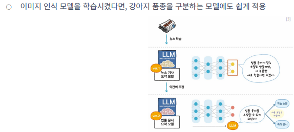
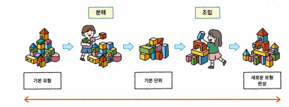
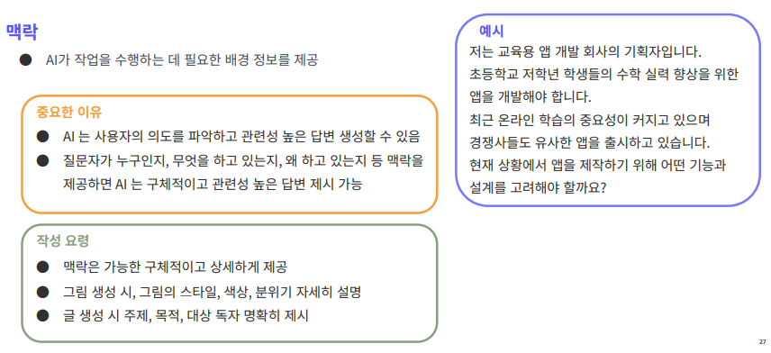
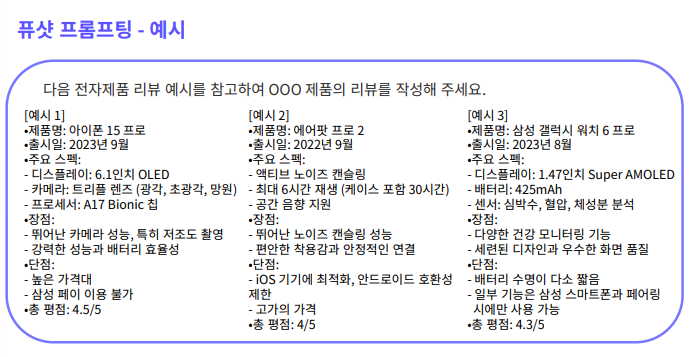
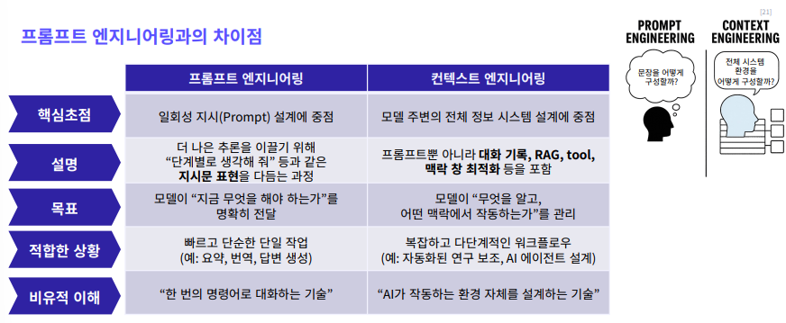

# AI 개념 정리
## 25년 12월 24일 3번째 수업

---
## 트랜스포머 알고리즘

### 트랜스포머란?
- 과거의 언어 모델 RNN : 문장 등의 데이터 순서를 고려하며 학습한느 딥러닝
- 문제점 : 하나씩 순차적으로 처리하여 병렬처리 불가능 -> 학습이 느림
          긴 문맥을 이해하지 못함 
- LSTM은 정보 보존 능력은 향상되었으나 문제는 해결하지 못함

=> 문장 전체 맥락을 한번에 파악하기 위해 트랜스포머 등장

### 트랜스포머의 핵심원리 : Self-Attention 매커니즘
- 트랜스포머는 "Self-attention" 매커니즘이 핵심
- Self-attention 매커니즘 : 문장의 각 단어가 다른 단어와 얼마나 연관 되었는지 계산

### 트랜스포머의 특징
- 병렬처리 : 문장의 모든 단어 문맥을 동시에 계산이 가능
- 장거리 의존성 : "철수는 어제 바나나를 먹었다, 그는 다음에도 바나나를 먹어야겠다고 생각했다"와 같은 문장에서 멀리 떨어진 단어의 관계를 인식
_ 위치 정보 : 단어의 위치 정보를 활용해 "강아지가 고양이를 쫓았다"와 "고양이가 강아지를 쫒았다"의 의미 차이를 구별

### 자기지도 학습
- 레이블이 없는 방대한 양의 텍스트 데이터를 스스로 학습 (사람의 지도가 필요하지 않음)

### 전이 학습
- 기존 모델의 지식을 새로운 관련 작업에 적용해 모델을 효율적으로 학습

### 사전 학습 (Pre-training)
- 엄청난 양의 텍스트를 읽으며 언어의 기본적인 구조와 패턴, 세상의 일반적인 지식 습득

### 미세 조정 (Fine-tuning)
- 특정 작업에 맞게 추가 학습 수행 (상대적으로 적은 양의 데이터로 진행 가능)

### 인간 피드백 강화 학습 조정
- 인간 피드백 강화 학습 (**RLHF**) : 모델의 출력을 인간이 평가, 그 평가를 기반으로 모델을 더욱 개선

## 생성형 AI 모델

### 생성적 적대 신경망 (GAN)
- 두 개의 인공 신경망인 생성자와 판별자가 서로 경쟁하며 학습 (고품질 데이터 생성 가능)

### 확산 모델 (Diffusion model)
- 데이터에 점진적으로 노이즈 추가후 원래 상태로 복원하는 과정을 학습하는 모델  
  생성 과정이 점진적이며 제어 가능  
  텍스트나 다른 형태의 조건 쉽게 결합 
  ex : 텍스트-이미지 변환

### 변분 오토인코더 (VAE)
- 데이터를 압축하고 다시 풀어내는 과정(재구성)에서 새로운것을 만들어 내는 AI 모델  
  압축하는 과정에서 숨겨진 특성(잠재공간)을 학습 이를 재구성해 새로운 데이터 생성  
  상대적으로 안정적인 학습 가능  
  생성된 데이터 특성 조작, 해석 쉬움  
  ex : 흐릿한 이미지를 선명하게 복원, 이상 탐지(의료 이미지, 영상 등)
  

  ### 플로우 기반 모델 (Flow based model)
  - 복잡한 확률 분포를 단순한 분포로 변환하고 이를 다시 역변환하여 데이터를 생성  
    복잡한 모형 분행 방법과 조립 방법 정확한 기억  
    정확한 확률 계산 가능  
    ex : 실제 사진과 구별 어려운 고품질 이미지 생성
  

  ### 생성형 AI 모델 작동 방식
  

## 프롬프트 엔지니어링 개념
- 프롬프트 : AI와 소통하기 위해 사용하는 텍스트 기반 명령어
- 프로프트 엔지니어링 : AI 에게 효과적으로 지시를 내리고 원하는 결과를 얻어내는 기술

### 프롬프트 엔지니어링이 필요한 이유
- 최소한의 입력으로 원하는 결과를 정화갛고 빠르게 얻기 위해 -> 시간 절약
- 토큰을 아끼기 위해 -> 비용 절약
- AI 윤리적 사용 -> 편향된 결과를 출력하지 않고, 민감 정보 조절

### 필수 프롬프트 (지시사항)

### 필수 프롬프트 (맥락)

### 필수 프롬프트 (출력 형식)

### 보조 프롬프트 (입력 데이터)

### 보조 프롬프트 (제약 조건)

### 보조 프롬프트 (예시)

### 제로샷 프롬프팅
- AI에게 별로의 예시를 주지 않은 상태에서 새로운 작업을 하도록 요청하는 작업
- AI가 기존에 학습했던 내용을 바탕으로 처음 접하는 작업이나 질문에 대응  
  복잡하거나 전문적인 작업에선 정확도가 떨어짐  
  학습 범위를 벗어나는 주제에는 관련 없는 답변 생성이 높음
- ex : 기후 변화의 원인에 대해 설명해주세요, 현대 미술의 주요 특징을 5가지 나열해 주세요

### 원샷 프롬프팅
- AI에게 단 하나의 예시를 제공하여 작업 지시, 최소한의 정보로 최대한의 결과를 얻고자 할 때 사용
- 단점  
  단 하나의 예시만으로 모든 경우의 수 파악이 어려움  
  예시의 대표성이 낮다면 다른 방향으로 답변이 나옴 -> 대표성이 높은 예시 제공 필수

### 퓨셧 프롬프팅
- AI에게 여러 예시를 제공해 작업을 지시하는 방법
- 제로샷이나 원샷 프롬프팅에 비해 더 정확하고 일관된 결과
- 단점  
  제공된 예시들 사이 일관성이 부족할 경우 AI가 혼란  
  너무 많은 예시 제공 시 AI가 예시에 과의존 -> 창의성 제한

### CoT (Chain of Thought)
- 사슬을 역듯이 AI 모델이 논리적인 사고 단계를 거쳐 최종 답을 도출하도록 유도하는 방식
- 장점  
  AI가 복잡한 문제를 해결하는 과정을 투병하게 보여줌  
  논리적인 사고 능력 향상에 도움  
  AI에게 차근차근 설명하도록 해 환각 현상 예방
- 단점  
  단순한 작업에 대해 불필요한 설명 요구 -> 효율성이 떨어짐  
  AI의 사고 과정이 인간의 논리와 일치하지 않을 수 있음 -> AI 의 사고과정 비판적 검토 필요

### 역활 할당 프롬프팅
- AI에게 특정 역활이나 관점을 부여해, 그 역활에 맞는 방식으로 응답 생성 유도
- AI가 특정 분야와 입장에 몰입, 더욱 일관되고 적절한 답변 제공
- 단점 : AI가 해당 분야에 전문성이 떨어질 경우, 답변이 부정확해짐

### 프롬프티 기법 결합
- 고급 기법을 상황에 맞게 적절히 활용

### 프롬프트 작성 방법
- 적절한 질문-답변 횟수 : 싱글턴 방식 VS 멀티턴 방식

- 한번에 한가지 주제만 물어보기  
  한번에 여러 주제를 다루려고 하면 AI는 각 요소를 개별적으로 해석 -> 복합하거나 불완정한 대답 생성  
  한번에 한 가지 주제만 물어보면 AI는 해당 주제에 집중 -> 정확하고 상세한 정보 제공  
    순차적으로 질문 -> 주제에 대해 더 깊은 대화  
    필요에 따라 추가 질문 -> 정보 구체화

- 역으로 질문하가  
  AI에게 더 효과적인 질문 방법을 알려달라 요청  
  "어떤 프롬프트를 입력해야 더 좋은 답변을 얻을 수 있을까?" -> AI가 스스로 문제 재구성, 필요한 정보 파악  
  기존 질문으로 원하는 정보를 정확히 얻지 못할때  
  깊이 있는 정보가 필요할 때  
  다루는 분야가 생소하여 이해도가 낮을 때  
  생각지도 못한 질문 방식이 필요할 때  
  AI의 답변 능력을 최대한 활용할 수 있는 방법을 알고 싶을때 

- AI 에게 피드백 주기  
  AI의 초기 응답을 바탕으로 더 나은 결과를 얻기 위해 지속적으로 소통하는 과정  
  AI가 사용자 의도를 파악하고, 적절한 정보를 제공  
    AI 답변 평가, 추가적인 지시, 수정 요청을 하는 것을 포함  
  복잡한 주제를 다룰 때 유용  
  AI와 효율적인 의사소통 방법 학습 가능
  

- 창의적인 시도  
  창의적인 프롬프트를 통해 AI의 잠재력을 끌어낼 수 있음  
  AI는 방대한 데이터를 기반으로 다양한 개념을 연결, 재조합하여 매우 창의적인 결과물을 만들어냄  
  우리의 사고 패턴을 벗어난 새로운 아이디어, 관점 제공 가능
  

- 명확하고 구체적인 프롬프트 사용  
  구체적이고 명확한 프롬프트를 사용하면 AI는 주어진 정보를 더 잘 해석하고 적절한 결과물을 생성  
  명확한 프롬프트 작성 방법  
    구체적인 맥락 제공  
    결과물 형식 명확하게 함  
    AI 답변에 제약 조건  
    예시 제공
    

## 컨텍스트 엔지니어링
- 컨텍스트 엔지니어링 : AI 모델이 적절하고 정확한 응답을 생성할 수 있도록 필요한 모든 정보와 도구를 정확한 시점에 제공하는 시스템적 설계 방식
- AI Agent가 사람이 주어진 목표를 해결하는 주된 방식

- 컨텍스트가 중요한 이유  
  질문 : "내일 시간 되세요?"  
  저품질 컨텍스트 : "네 가능합니다, 몇 시가 좋으신가요?" -> 컨텍스트 없이 단순 요청에만 반응  
  고품질 컨텍스트 : "내일은 일정이 있고, 목요일 오전에 가능합니다. 그때 어떠세요? -> AI가 사용자 캘린더, 이메일 히스토리, 도구 호출 기능 등을 활용한 결과  
    
  LLM의 한계 극복  
    기존 LLM : 긴 시퀀스 처리 한계와 환각(hallucination)문제  
    컨텍스트 엔지니어링 : 입력 관리와 구조적 프롬프트를 통한 이러한 한계를 완화  
  LLM 성능 극대화  
    RAG, CoT 등 컨텍스트 기반 깁버은 복잡한 추론과 정교한 답변을 가능  
    분야를 특정 지은 컨텍스트 제공시, 벙용 모델보다 뛰어난 성능 달성  
  한정된 자원 효율적 활용  
    필요한 정보만 선별하여 처리함으로써 연산량과 비용을 절감  
     기존 지식을 재활용하여 새로운 지식 생성의 호율성을 높임  
  AI의 미래 잠재력을 살현  
    별도 재학습 없이 새로운 작업 수행 기능

- 컨텍스트 엔지니어링 구성 요소  
  지시사항/시스템 프롬프트 (Instrucitions / System Prompt)  
    모델의 기본 역활과 말투, 규칙을 정의하는 초기 지시문  
    예시 : 규칙 포함 가능하며, 포함하는 것이 바람직함  
  사용자 프롬프트 (User Promt)  
    사용자가 즉시 요청하거나 질문하는 구체적인 작업 지시  
  단기 메모리 (Short- term Memory)  
    사용자가 즉시 요청하거나 질문하는 구체적인 작업 지시  
  장기 메모리 (Long-term Memony)  
    여러 대화에 걸쳐 축적된 지식  
    사용자의 선호, 과거 프로젝트 요약 또는 이후에도 기억해야 할 사질들을 포함  
  검색 증강 생성(RAG)  
    외부 문서-DB-API에서 가져온 정보를 답변 품질 향상에 활용  
  사용 가능한 도구 (Available Tools)  
    모델이 호출할 수 있는 외부 기능 정의  
  구도화된 출력 (Structured Output)  
    모델의 응답 형식을 미리 지정

