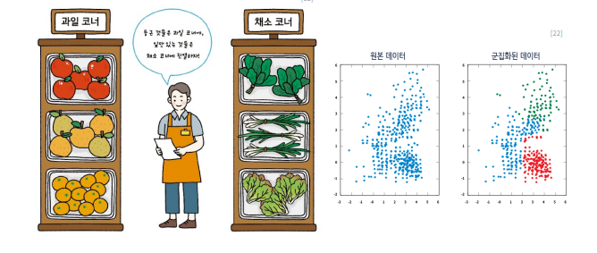
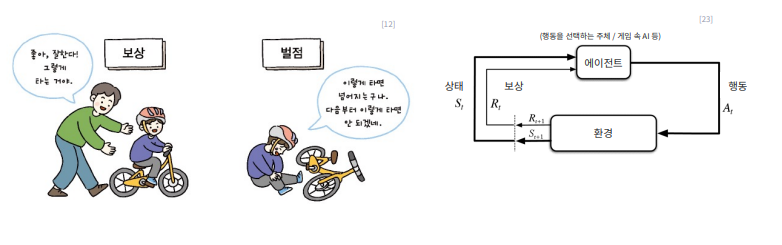
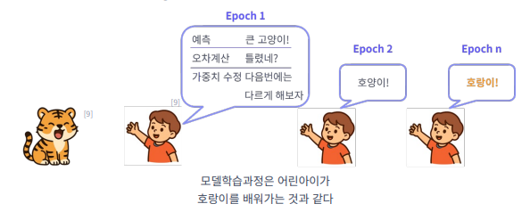
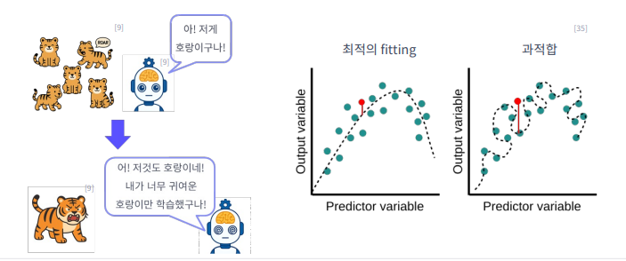
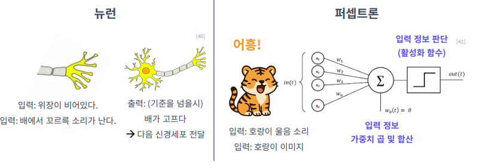
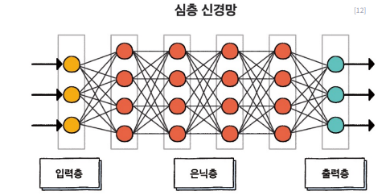

# AI 개념 정리

## 25년 12월 23일 2번째 수업

---

## ML  
- 기계학습이며 컴퓨터가 데이터를 바탕으로 스스로 학습 하고 성능을 향상 시키는것

### 주요 알고리즘

### 지도학습
- 문제의 정답을 알려주고 한번도 학습 하지 않은 데이터를 분류/ 예측 하는 방법  

- 학습한 데이터를 가지고 다시 평가하면 오버피팅이 발생할수 있다  
- 양질의 데이터와 정확한 레이블링이 있어야 정확한 지도학습이 가능함 
 

#### 자도학습의 종류

- **분류 알고리즘**  
  - 미리 학습한 내용을 기반으로 한번도 못본 데이터를 자동으로 분류해주는 모델
 [ 분류](image/04.png)  

- **회귀 알로리즘**  
  - 미리 학습한 내용을 기반으로 한번도 못 본 데이터의 값(수치)를 예측해주는 것  

---

### 비지도 학습
- 정답 없이 데이터의 특징이나 패턴을 스스로 찾아 내는 기계 학습  

- 정답은 없으며 데티어 속 숨은 구조, 패턴을 발견하는것이며  
  정답이 없기 때문에 결과 해석에 있어서 지도 학습 보다 어려움  

- **군집화 알고리즘**  
  - 비슷한 특성을 가진 것들을 그룹으로 모으는 것  

---

### 강화학습
- 특정 작업을 수행한 뒤 결과에 따라 보상이나 벌점을 받으면서 학습하는 방식  

---

## 기계학습 모델 데이터

- 기계학습 모델은 입력 데이터를 바탕으로 출력 데이터를 도출 (생성, 추론)

### 전처리
- 모델을 훈려하기 전에 데이터를 준비하는 과정  

### 특징 추출
- 가공되지 않은 입력 데이터에서 유용한 특지응ㄹ 추출  
- (기계학습 모델 성능 향상)

- 기계학습 전에 전처리 후 특징 (피처) 추출이 필수다  

---

## 기계학습 모델 - 학습

- 학습 → 검증 → 테스트 과정으로 진행  

- 기계학습 모델을 학습할때는 입력 데이터와 추출된 특징을 바탕으로  
  패턴을 찾아내고 일반화하는 과정을 수행  

- 학습 데이터와 검증 데이터를 나누어야 한다 8대 2 비율  

### 학습 단계별 역할

- **학습**  
  - 입력과 정답 관계를 학습 ( 내부 가중치 조정)

- **검증**  
  - 특정 데이터에 집중적으로 학습이 되지 않았는지 과적합 여부 확인  
  - 하이퍼파라미터 값 조정  

- **테스트**  
  - 새로운 ( 처음 사용) 데이터를 가지고 일반화 성능 테스트를 진행  

---

## 데이터와 관련 문제

### 차원의 저주
- 데이터 학습을 위해 차원이 증가하면서  
  학습데이터 수가 차원을 수 보다 적어져 성능이 저하되는 현상

### 데이터 불균형 문제
- 데이터 불균형 : 특정 범주의 데이터가 다른 범주에 비해 지나치게 많거나 적은 경우 모델 성능이 저하되는 문제

### 데이터 전처리 - 데이터 레이블링
- 지도학습에서 사람이 학습 데이터에 무엇이 "정답"인지 표시해주는 과정

### 데이터 전처리 - 정규화
- 변수마다 단위나 크기가 다를 때, 일정한 범위로 맞춰주는 과정 / 데이터의 단위 차이가 너무 크면 학습에 문제가 발생

  
  

### 데이터 전처리 - 결측치 처리
- 누락된 데이터를 평균, 중앙값 , 이전

### 데이터 전처리 - 이상치 제거
- 장상적인 범위에서 벗어난 비정상적인 데이터를 찾아내어 제거하거나 수정

### 모델학습 과정
- 학습은 여러 번의 에폭(Epoch, 전체 데이터셋이 신경망을 통과한 횟수)을 거쳐 진행된다
- 매 반복마다 모델은 예측 -> 오차 계산 -> 가중치 수정을 수행
-- 오차(Error) : 예측값과 실제 값의 차이
-- 가중치(Wight) : 각 입력값의 중료도를 조절하는 숫자

  
  

### 경사하강법
- 손실함수(Loss Function) : 오차를 수치로 계산한 결과
- 경사하강법 (Gradient descent) : 손실 함수가 최소가 되도록 가중치를 반복적으로 조정하는 알고리즘
<video controls width="600">
  <source src="image/19.mp4" type="video/mp4">
</video>

### 학습률
- 학습률(Learning Rate) : 한 번의 학습에서 가중치를 얼마나 크게 바꿀지 결정하는 변수
- 학습률이 너무 높으면 최적점을 지나치고, 너무 낮으면 학습이 느려짐

### 과적합
- 과적합(Overfitting) : 학습 데이터에는 잘 맞지만, 새로운 데이터에서는 성능이 떨어지는 현상
- 징후 : 훈련 정확도는 높지만 검증 정확도는 낮음

### 하이퍼파라미터 튜닝
- 하이퍼파라미터 튜닝 (Hyperparameter Tuning) : 학습 전에 사람이 직접 정하는 기계학습 변수값
하이퍼파라미터는 모델의 성능을 좌우하는 핵심 설정
예시 : Epoch 횟수, 학습률, 학습 모델 등

### 데이터 증강
- 데이터 증강 (Data Augmentation) : 원본 데이터를 변형하여, 새로운 학습 데이터를 인위적으로 만들어내는 방법
목적 : 데이터가 적을떄 모델의 과적합 방지를 위해 다양성 확보
예시 : 이미지 -> 회전, 반전, 색상 변화, 확대-축소 / 텍스트 -> 단어 순서 변경, 동의어 치환 / 음성 -> 속도 조정, 잡음 추가

## 딥러닝
- 기계학습의 한 분야, 대량의 데이터를 학습해 복잡한 패턴을 파악
인간의 뇌 구조를 모방한 심층신경만 사용

### 인공뉴런구조(퍼셉트론/Perceptrin)
- 사람의 뇌 신경은 입력을 받아 일정 기준을 넘으면 신호로 출력
- 인공뉴런도 여러 입력값에 가중치를 곱하고 합산하여, 활성화 함수 (Activation function)를 통해 출력을 결정

### 인공뉴런구조 (퍼셉트론)
- 가중치 : 나에게 중효한 정보일수록 더 크게 반영
- 편향(Bias) : 아무 입력이 없어도 한쪽으로 판단이 기울 수 있는 기본 값
- 활성화 함수 : 입력을 종합해 결과를 내는 "판단 행동"

### 다층퍼셉트론 (간단한 인공 신경망)
- 입력층 (input) -> 은닉층 (Hidden) -> 출력증(Output) 구조
- 여러 퍼셉트론을 연결하면 복잡한 패턴 핛ㅂ 가능
- 파라미터 (Parameter) : 모델이 학습 과정에서 업데이트하는 가중치와 편향을 의미함

- 은닉층 : 입력층에서 전달 받은 특성들을 훈련(연산)시키는 층
- 은칙층이 깊어질수록 복잡한 패턴 데이터 학습 가능

### 침층신경망
- 은닉층을 많이 쌓아 복잡한 패턴까지 학습 가능
- 파라미터가 많아질수록 표현력은 증가하지만, 계산량도 커짐
- CPU, GPU 등 연산 장치의 발달로 더 깊은 심층신경망이 가능해짐

### 역전파와 기울기 소실
- 순실파 (Forward Propagation) : 입력값이 뉴럴 네트워크를 "앞으로" 통과하며, 출력값을 생성하는 과정
- 역전파 (Back Propagation) : 오차를 거꾸로 전달해 가중치를 수정
- 기울기 소실 (Gradient Vanishing) : 층이 깊어질수록 오차가 앞쪽에 전달되지 않음
- 해결책 : ReLU 같은 활성화 함수로 개선

### 딥러닝 알고리즘 소개
- CNN : 이미지, 영상 처리에 특화
- 작은 영역의 특징을 감지해 전체 윤확을 이해
- 활용 : 이미지 분류, 자율주챙, 의료 영상 분석

### RNN & LSTM
- 시간의 흐름에 따라 연결된 데이터를 (순차데이터 / Sequence data)를 학습하는 신경망
- RNN (Recurrent Neural Network) : 이전 단계의 출력을 다음 단계 입력에 반영
- LSTM (Long short-Term Memory) : RNN의 단기 기억 한계를 보완해 중요 정보는 장기기억하고 불필요한 정보 제거
- 활용 : 음성인식, 번역, 감정 분석, 자연어처리, 시계열 데이터 분석 등

### 딥러닝의 장점과 단점
- 장덤
AI가 스스로 학습하고 규칙과 특징을 발견
미묘한 차이를 구분하며 높은 정확도
새로운 어플리케이션으로 확장하기에 적합

- 단점 
방대한 데이터와 연산 자원 필요
학습 과정이 "박스처럼"처럼 불투평
하이퍼파이터를 탐색하기 위해 많은 시행착오 필요