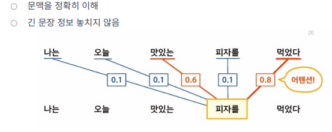
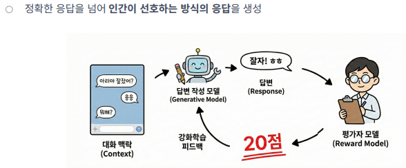
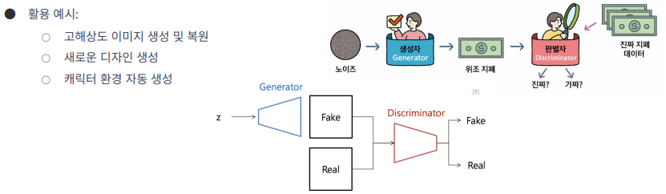
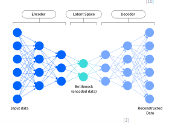

# AI 개념 정리

## 25년 12월 24일 3번째 수업

---
## 트랜스포머 알고리즘

### 트랜스포머란?
- 과거의 언어 모델 RNN : 문장 등의 데이터 순서를 고려하며 학습한느 딥러닝
- 문제점 : 하나씩 순차적으로 처리하여 병렬처리 불가능 -> 학습이 느림
          긴 문맥을 이해하지 못함 
- LSTM은 정보 보존 능력은 향상되었으나 문제는 해결하지 못함

=> 문장 전체 맥락을 한번에 파악하기 위해 트랜스포머 등장

### 트랜스포머의 핵심원리 : Self-Attention 매커니즘
- 트랜스포머는 "Self-attention" 매커니즘이 핵심
- Self-attention 매커니즘 : 문장의 각 단어가 다른 단어와 얼마나 연관 되었는지 계산

### 트랜스포머의 특징
- 병렬처리 : 문장의 모든 단어 문맥을 동시에 계산이 가능
- 장거리 의존성 : "철수는 어제 바나나를 먹었다, 그는 다음에도 바나나를 먹어야겠다고 생각했다"와 같은 문장에서 멀리 떨어진 단어의 관계를 인식
_ 위치 정보 : 단어의 위치 정보를 활용해 "강아지가 고양이를 쫓았다"와 "고양이가 강아지를 쫒았다"의 의미 차이를 구별

### 자기지도 학습
- 레이블이 없는 방대한 양의 텍스트 데이터를 스스로 학습 (사람의 지도가 필요하지 않음)

### 전이 학습
- 기존 모델의 지식을 새로운 관련 작업에 적용해 모델을 효율적으로 학습

### 사전 학습 (Pre-training)
- 엄청난 양의 텍스트를 읽으며 언어의 기본적인 구조와 패턴, 세상의 일반적인 지식 습득

### 미세 조정 (Fine-tuning)
- 특정 작업에 맞게 추가 학습 수행 (상대적으로 적은 양의 데이터로 진행 가능)

### 인간 피드백 강화 학습 조정
- 인간 피드백 강화 학습 (**RLHF**) : 모델의 출력을 인간이 평가, 그 평가를 기반으로 모델을 더욱 개선

## 생성형 AI 모델

### 생성적 적대 신경망 (GAN)
- 두 개의 인공 신경망인 생성자와 판별자가 서로 경쟁하며 학습 (고품질 데이터 생성 가능)

### 확산 모델 (Diffusion model)
- 데이터에 점진적으로 노이즈 추가후 원래 상태로 복원하는 과정을 학습하는 모델  
  생성 과정이 점진적이며 제어 가능  
  텍스트나 다른 형태의 조건 쉽게 결합 
  ex : 텍스트-이미지 변환

### 변분 오토인코더 (VAE)
- 데이터를 압축하고 다시 풀어내는 과정(재구성)에서 새로운것을 만들어 내는 AI 모델  
  압축하는 과정에서 숨겨진 특성(잠재공간)을 학습 이를 재구성해 새로운 데이터 생성  
  상대적으로 안정적인 학습 가능  
  생성된 데이터 특성 조작, 해석 쉬움  
  ex : 흐릿한 이미지를 선명하게 복원, 이상 탐지(의료 이미지, 영상 등)
  