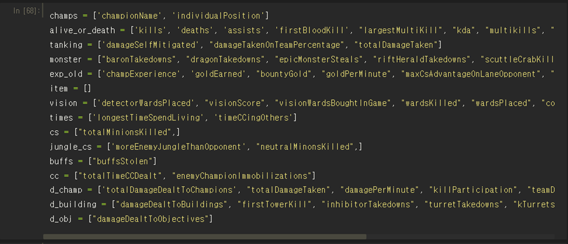
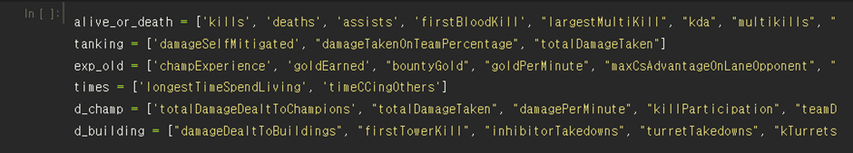
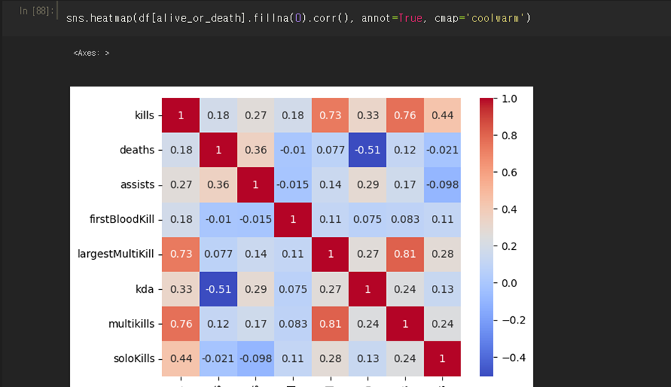
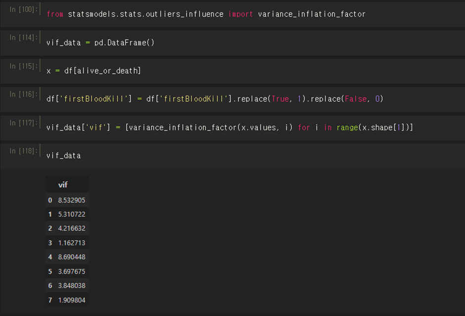

# 프로젝트 내용

riot api로 부터 데이터 로드를 직접해보고, 승리와 관련된 지표를 머신러닝을 통해 찾아내어 분석한다. 
승률을 n인분 지표로 변환도 해보고, 분석 결과를 시각화하고, 웹사이트에 출력할 수 있도록 한다.

# 프로젝트 과정

1. 데이터 로드 (riot api)
2. 데이터 전처리
3. 데이터 분석(ML) 및 시각화
4. 웹디자인

# 프로젝트 진행시 알아야할 내용

필수 : python, pandas, sklearn, html, django 사용방법 
권장 : jupyter, css

# 팀 배정

1. 데이터 로드
   - 팀장 :
   - 팀원 :
2. 데이터 전처리
   - 팀장 :
   - 팀원 :
3. 데이터 분석
   - 팀장 :
   - 팀원 :
4. 웹디자인
   - 팀장 :
   - 팀원 :

# 진행상황

- 2023-09-20 : 프로젝트 인원 모집 완료 및 프로젝트 개요 설명
  - contribute : 김도형
- 2023-09-23 : 데이터 로드 연습 및 데이터 살펴보기
  - contribute : 김찬결

# 2023-11-09 회의

분류된 피처 카테고리를 인당 1~2개씩 골라가서 칼럼 정제(뭐 뽑을지 선택, 전부 다 or 아예 안 뽑는 것까지 고려)
카테고리 내의 피처간 연관
다른 카테고리들과의 연관성
카테고리가 승패 확률 분류에의 유의성
포지션별 칼럼 유의성(ex, 특히 정글러&서포터는 다른 포지션들에 비해서 칼럼별 유의도가 뚜렷하게 다를 것으로 판단됨)
기타 이상치 정제방안(ex, 초장시간 게임, 8만이 넘는 딜량 등등)
기타 특이사항 EDA(특정 챔프에는 이 피처가 승패 연관성이 굉장히 높더라 등등)

현재 남은 카테고리

참고사항

Correlation heatmap, correlation matrix, VIF, linear_regression(or sigmoid) 이후 기울기 산정 등 활용
